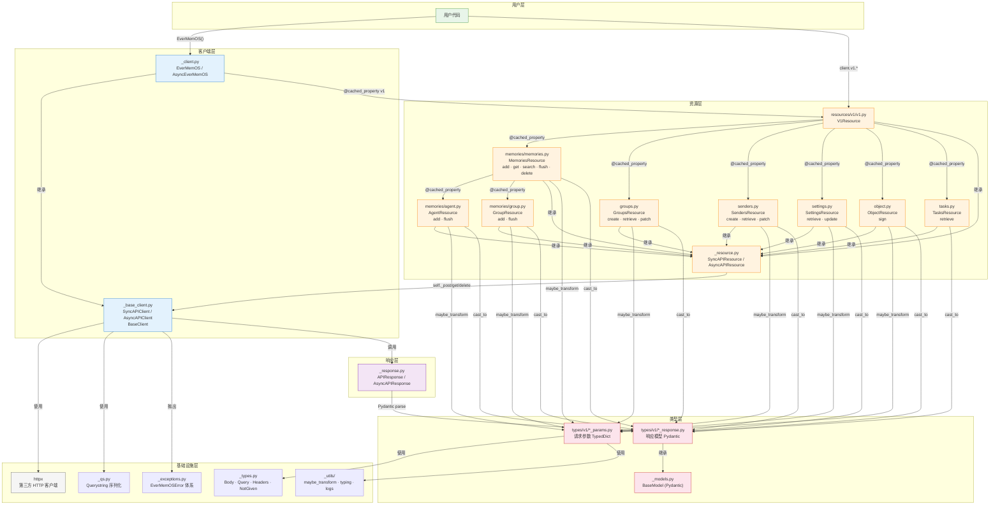

# EverMemOS Python SDK 源码分析（v0.3.6 / 2026-03-30）

## 核心结论

| 维度 | 结论 |
|------|------|
| SDK 版本 | `evermemos-0.3.6`，对应 `openapi-0330.json` |
| 包名 | `EverMemOS`（源码目录），PyPI 包名 `evermemos` |
| 认证方式 | `api_key` 自动从 `EVERMEMOS_API_KEY` 读取，`base_url` 自动从 `EVER_MEM_OS_BASE_URL` 读取；直接 `EverMemOS()` 即可（注：`auth_headers` 代码层面未 override，但实际测试样例无需手动注入 Authorization 头） |
| 资源入口 | `client.v1.{memories,groups,senders,settings,object,tasks}` |
| 新增资源（vs 旧版） | `memories.agent`、`memories.group`、`groups`、`senders`、`settings`、`object`、`tasks` |
| 消息格式变化 | 旧版：单条扁平 `content/sender`；新版：`messages[]` 数组，每条含 `role/timestamp/content` |
| 异步任务 | `add(..., async_mode=True)` → `data.task_id` → `tasks.retrieve(task_id)` |

---

## 1. 入口：示例调用

```python
# examples/01_add_sync.py
from evermemos import EverMemOS
import os, time

client = EverMemOS()
# api_key 自动从 EVERMEMOS_API_KEY 读取；base_url 自动从 EVER_MEM_OS_BASE_URL 读取

resp = client.v1.memories.add(
    user_id="user_001",
    messages=[
        {"role": "user", "timestamp": int(time.time() * 1000), "content": "Hello"},
        {"role": "assistant", "timestamp": int(time.time() * 1000) + 500, "content": "Hi"},
    ],
)
print(resp.data.status, resp.data.message_count)
```

---

## 2. 调用链分析

### 2.1 客户端初始化

**路径**: `EverMemOS.__init__()` → `SyncAPIClient.__init__()` → `BaseClient.__init__()`

1. **`EverMemOS`** (`src/EverMemOS/_client.py:44`)
   - 继承自 `SyncAPIClient`
   - `api_key`：从参数或 `EVERMEMOS_API_KEY` 读取，缺失则抛 `EverMemOSError`
   - `base_url`：从参数或 `EVER_MEM_OS_BASE_URL` 读取，默认 `https://api.evermind.ai`
   - **注意**：未 override `auth_headers`，`api_key` 不会自动注入 `Authorization` 头

2. **`SyncAPIClient`** (`src/EverMemOS/_base_client.py`)
   - 初始化 `httpx.Client`，管理超时、重试

3. **`BaseClient`** (`src/EverMemOS/_base_client.py`)
   - 管理 `base_url`、`timeout`、`max_retries`、`custom_headers`

### 2.2 资源访问链

**路径**: `client.v1` → `client.v1.memories` → `client.v1.memories.add()`

```
EverMemOS._client.py
  └── v1  @cached_property → V1Resource
        ├── groups    → GroupsResource
        ├── settings  → SettingsResource
        ├── senders   → SendersResource
        ├── memories  → MemoriesResource
        │     ├── agent  → AgentResource
        │     └── group  → GroupResource
        ├── object    → ObjectResource
        └── tasks     → TasksResource
```

所有资源均使用 `@cached_property` 懒加载，继承 `SyncAPIResource` / `AsyncAPIResource`。

### 2.3 API 请求执行

**路径**: `memories.add()` → `_post()` → `SyncAPIClient.request()`

```python
# memories.add() 核心逻辑（memories.py:146）
def add(self, *, messages, user_id, async_mode=omit, session_id=omit, ...) -> AddResponse:
    return self._post(
        "/api/v1/memories",
        body=maybe_transform(
            {"messages": messages, "user_id": user_id, "async_mode": async_mode, "session_id": session_id},
            memory_add_params.MemoryAddParams,
        ),
        options=make_request_options(...),
        cast_to=AddResponse,
    )
```

`_post()` 绑定到 `client.post()`，构建 `FinalRequestOptions` 后交由 `SyncAPIClient.request()` 执行，包含重试、错误处理、响应解析。

### 2.4 响应处理

**路径**: `_process_response()` → `APIResponse.parse()` → Pydantic 模型

```python
# types/v1/add_response.py
class AddResponse(BaseModel):
    data: Optional[AddResult] = None

# types/v1/add_result.py
class AddResult(BaseModel):
    message: Optional[str] = None          # 状态描述
    message_count: Optional[int] = None    # 接收消息数
    status: Optional[Literal["accumulated", "extracted"]] = None
    task_id: Optional[str] = None          # async_mode=True 时返回
```

---

## 3. 资源层详解

### 3.1 `memories`（个人记忆）

**端点**: `POST /api/v1/memories`

| 方法 | 签名要点 | 返回 |
|------|---------|------|
| `add()` | `messages: Iterable[MessageItemParam]`, `user_id: str`, `async_mode?`, `session_id?` | `AddResponse` |
| `get()` | `filters: Dict`, `memory_type?`, `page?`, `page_size?` | `GetMemoriesResponse` |
| `search()` | `filters: Dict`, `query: str`, `method?` (hybrid/vector/keyword/agentic), `top_k?` | `SearchMemoriesResponse` |
| `flush()` | `user_id: str`, `session_id?` | `FlushResponse` |
| `delete()` | `user_id?`, `memory_id?`, `session_id?`, `sender_id?`, `group_id?` | `None` (204) |

**`MessageItemParam`** 字段：

```python
class MessageItemParam(TypedDict, total=False):
    content:   Required[Union[str, Iterable[ContentItemParam]]]  # 支持纯字符串简写
    role:      Required[Literal["user", "assistant"]]
    timestamp: Required[int]   # unix 毫秒
    sender_id: Optional[str]
```

### 3.2 `memories.agent`（Agent 轨迹记忆）

**端点**: `POST /api/v1/memories/agent`

| 方法 | 签名要点 | 返回 |
|------|---------|------|
| `add()` | `messages: Iterable[AgentMessageItemParam]`, `user_id: str`, `async_mode?`, `session_id?` | `AddResponse` |
| `flush()` | `user_id: str`, `session_id?` | `FlushResponse` |

**`AgentMessageItemParam`** 扩展了 `role='tool'` 和 `tool_calls` 字段：

```python
class AgentMessageItemParam(TypedDict, total=False):
    role:         Required[Literal["user", "assistant", "tool"]]
    timestamp:    Required[int]
    content:      Union[str, Iterable[ContentItemParam], None]  # assistant+tool_calls 时可为 null
    sender_id:    Optional[str]
    tool_call_id: Optional[str]    # role='tool' 时必填
    tool_calls:   Optional[Iterable[ToolCallParam]]  # role='assistant' 时使用
```

### 3.3 `memories.group`（群组记忆）

**端点**: `POST /api/v1/memories/group`

| 方法 | 签名要点 | 返回 |
|------|---------|------|
| `add()` | `group_id: str`, `messages: Iterable[GroupMessageItemParam]`, `async_mode?`, `group_meta?` | `AddResponse` |
| `flush()` | `group_id: str`, `session_id?` | `FlushResponse` |

**`GroupMessageItemParam`** 中 `sender_id` 为 Required（区别于个人记忆的 Optional）：

```python
class GroupMessageItemParam(TypedDict, total=False):
    content:     Required[Union[str, Iterable[ContentItemParam]]]
    role:        Required[Literal["user", "assistant"]]
    sender_id:   Required[str]   # 群组必填
    timestamp:   Required[int]
    message_id:  Optional[str]
    sender_name: Optional[str]
```

### 3.4 `groups`（群组管理）

| 方法 | HTTP | 说明 |
|------|------|------|
| `create()` | POST `/api/v1/groups` | 创建群组 |
| `retrieve()` | GET `/api/v1/groups/{group_id}` | 查询群组 |
| `patch()` | PATCH `/api/v1/groups/{group_id}` | 更新群组 |

### 3.5 `senders`（发送者管理）

| 方法 | HTTP | 说明 |
|------|------|------|
| `create()` | POST `/api/v1/senders` | 创建发送者 |
| `retrieve()` | GET `/api/v1/senders/{sender_id}` | 查询发送者 |
| `patch()` | PATCH `/api/v1/senders/{sender_id}` | 更新发送者 |

### 3.6 `settings`（系统设置）

| 方法 | HTTP | 说明 |
|------|------|------|
| `retrieve()` | GET `/api/v1/settings` | 获取设置 |
| `update()` | PUT `/api/v1/settings` | 更新设置（含 LLM 配置） |

### 3.7 `object`（文件预签名）

| 方法 | HTTP | 说明 |
|------|------|------|
| `sign()` | POST `/api/v1/object/sign` | 批量预签名，返回上传 URL |

```python
resp = client.v1.object.sign(
    object_list=[{"file_id": "f1", "file_name": "img.png", "file_type": "image"}]
)
```

### 3.8 `tasks`（异步任务状态）

| 方法 | HTTP | 说明 |
|------|------|------|
| `retrieve(task_id)` | GET `/api/v1/tasks/{task_id}` | 查询任务状态 |

---

## 4. 核心模块架构

### 4.1 目录结构

```
src/EverMemOS/
├── _client.py          # EverMemOS / AsyncEverMemOS 客户端入口
├── _base_client.py     # SyncAPIClient / AsyncAPIClient / BaseClient
├── _resource.py        # SyncAPIResource / AsyncAPIResource 基类
├── _response.py        # APIResponse / AsyncAPIResponse 响应解析
├── _models.py          # Pydantic BaseModel 基类
├── _exceptions.py      # 异常类体系
├── _types.py           # 公共类型定义
├── _version.py         # __version__ = "0.3.6"
├── _utils/             # 辅助工具（transform, typing, logs...）
├── resources/
│   └── v1/
│       ├── v1.py                     # V1Resource（根资源）
│       ├── memories/
│       │   ├── memories.py           # MemoriesResource
│       │   ├── agent.py              # AgentResource
│       │   └── group.py             # GroupResource
│       ├── groups.py                 # GroupsResource
│       ├── senders.py               # SendersResource
│       ├── settings.py              # SettingsResource
│       ├── object.py                # ObjectResource
│       └── tasks.py                 # TasksResource
└── types/
    └── v1/
        ├── message_item_param.py     # 个人记忆消息
        ├── memories/
        │   ├── agent_message_item_param.py   # Agent 消息（含 tool_calls）
        │   ├── group_message_item_param.py   # 群组消息（sender_id 必填）
        │   ├── tool_call_param.py
        │   └── tool_call_function_param.py
        ├── add_response.py / add_result.py
        ├── get_memories_response.py / get_mem_response.py
        ├── search_memories_response.py / search_memories_response_data.py
        ├── flush_response.py / flush_result.py
        ├── group_*.py / sender_*.py / settings_*.py
        ├── object_sign_*.py
        └── get_task_status_response.py / task_status_result.py
```

### 4.2 模块依赖拓扑



### 4.3 依赖关系说明

| 层级 | 模块 | 依赖 | 被依赖 |
|------|------|------|--------|
| 客户端层 | `_client.py` | `_base_client`, `_exceptions`, `_version` | 用户代码 |
| 客户端层 | `_base_client.py` | `httpx`, `_qs`, `_response`, `_exceptions`, `_types`, `_utils` | `_client`, 所有 Resource |
| 资源层 | `_resource.py` | `_base_client` | 所有具体 Resource |
| 资源层 | `resources/v1/*.py` | `_resource`, `types/v1/*`, `_utils.maybe_transform` | `_client` (via v1 property) |
| 响应层 | `_response.py` | `_models`, `_types`, `_utils` | `_base_client` |
| 类型层 | `types/v1/*_params.py` | `_types.py`（TypedDict base） | Resource 方法入参 |
| 类型层 | `types/v1/*_response.py` | `_models.py`（Pydantic BaseModel） | `_response`, Resource cast_to |
| 基础设施 | `_utils/` | 无内部依赖 | `_base_client`, `_response`, `types` |
| 基础设施 | `_exceptions.py` | 无内部依赖 | `_base_client`, `_client` |

---

## 5. 数据流转图

```
用户代码
    ↓
EverMemOS(api_key=..., default_headers={"Authorization": "Bearer ..."})
    ↓  (base_url = EVER_MEM_OS_BASE_URL | https://api.evermind.ai)
client.v1.memories.add(user_id=..., messages=[...])
    ↓  (maybe_transform → MemoryAddParams)
_post("/api/v1/memories")
    ↓
SyncAPIClient.request()
    ↓  (构建请求、httpx.Client.send、重试)
_process_response()
    ↓  (JSON 解析、Pydantic 验证)
AddResponse(data=AddResult(status="accumulated"|"extracted", task_id=...))
```

---

## 6. 与旧版 SDK 对比

| 维度 | 旧版（分析文档 sdk_source_analysis.md） | 新版 v0.3.6（本文档） |
|------|----------------------------------------|----------------------|
| 客户端入口 | `client.v1.memories.create()` | `client.v1.memories.add()` |
| 消息格式 | 单条扁平：`content`, `create_time`, `sender` | `messages[]` 数组，每条含 `role/timestamp/content` |
| 资源树 | `memories`, `stats` | `memories`(+agent/group), `groups`, `senders`, `settings`, `object`, `tasks` |
| 响应模型 | `MemoryCreateResponse(message, request_id, status)` | `AddResponse(data: AddResult(status, message_count, task_id))` |
| 异步任务轮询 | `client.v0.status.request.get()` | `client.v1.tasks.retrieve(task_id)` |
| Agent 消息 | 不支持 | `memories.agent.add()`，支持 `tool_calls` |
| 群组记忆 | 不支持 | `memories.group.add()`，`sender_id` 必填 |
| 文件签名 | 单文件字段 | `object.sign(object_list=[...])` 批量 |
| 认证注入 | `auth_headers` 同样未实现 | 同左，workaround 相同 |

---

## 7. 设计模式（与旧版一致）

- **资源模式**：每个 API 端点对应一个资源类，继承 `SyncAPIResource`
- **懒加载**：`@cached_property` 延迟创建资源实例
- **装饰器响应**：`with_raw_response` / `with_streaming_response` 改变响应行为
- **同步/异步对称**：每个资源均有 `Sync` / `Async` 两套实现

---

## 参考

- SDK 源码路径：`evermemos-openapi-samples/sdks/test/EverMemOS-python`
- Spec 文件：`docs/openapi-specs/openapi-0330.json`
- 旧版分析：`evermemos/functions/python-client-sdk/sdk_source_analysis.md`
