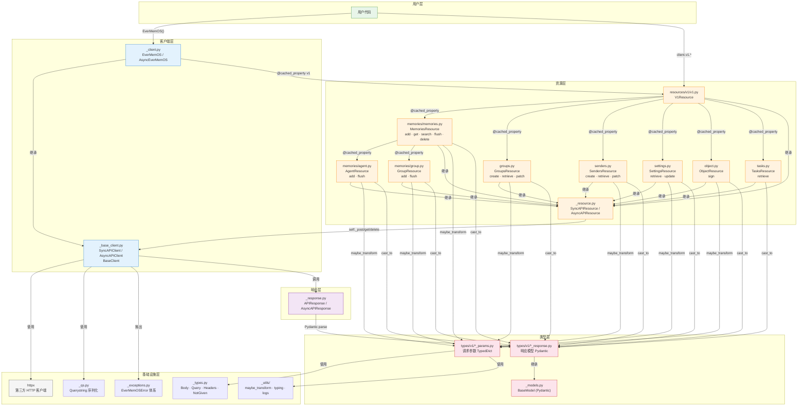

# EverMemOS Python SDK 源码分析（v0.3.6 / 2026-03-30）

## 核心结论

| 维度 | 结论 |
|------|------|
| SDK 版本 | `evermemos-0.3.6`，对应 `openapi-0330.json` |
| 包名 | `EverMemOS`（源码目录），PyPI 包名 `evermemos` |
| 认证方式 | `api_key` 自动从 `EVERMEMOS_API_KEY` 读取，`base_url` 自动从 `EVER_MEM_OS_BASE_URL` 读取；直接 `EverMemOS()` 即可（注：`auth_headers` 代码层面未 override，但实际测试样例无需手动注入 Authorization 头） |
| 资源入口 | `client.v1.{memories,groups,senders,settings,object,tasks}` |
| 新增资源（vs 旧版） | `memories.agent`、`memories.group`、`groups`、`senders`、`settings`、`object`、`tasks` |
| 消息格式变化 | 旧版：单条扁平 `content/sender`；新版：`messages[]` 数组，每条含 `role/timestamp/content` |
| 异步任务 | `add(..., async_mode=True)` → `data.task_id` → `tasks.retrieve(task_id)` |

---

## 1. 入口：示例调用

```python
# examples/01_add_sync.py
from evermemos import EverMemOS
import os, time

client = EverMemOS()
# api_key 自动从 EVERMEMOS_API_KEY 读取；base_url 自动从 EVER_MEM_OS_BASE_URL 读取

resp = client.v1.memories.add(
    user_id="user_001",
    messages=[
        {"role": "user", "timestamp": int(time.time() * 1000), "content": "Hello"},
        {"role": "assistant", "timestamp": int(time.time() * 1000) + 500, "content": "Hi"},
    ],
)
print(resp.data.status, resp.data.message_count)
```

---

## 2. 调用链分析

### 2.1 客户端初始化

**路径**: `EverMemOS.__init__()` → `SyncAPIClient.__init__()` → `BaseClient.__init__()`

1. **`EverMemOS`** (`src/EverMemOS/_client.py:44`)
   - 继承自 `SyncAPIClient`
   - `api_key`：从参数或 `EVERMEMOS_API_KEY` 读取，缺失则抛 `EverMemOSError`
   - `base_url`：从参数或 `EVER_MEM_OS_BASE_URL` 读取，默认 `https://api.evermind.ai`
   - **注意**：未 override `auth_headers`，`api_key` 不会自动注入 `Authorization` 头

2. **`SyncAPIClient`** (`src/EverMemOS/_base_client.py`)
   - 初始化 `httpx.Client`，管理超时、重试

3. **`BaseClient`** (`src/EverMemOS/_base_client.py`)
   - 管理 `base_url`、`timeout`、`max_retries`、`custom_headers`

### 2.2 资源访问链

**路径**: `client.v1` → `client.v1.memories` → `client.v1.memories.add()`

```
EverMemOS._client.py
  └── v1  @cached_property → V1Resource
        ├── groups    → GroupsResource
        ├── settings  → SettingsResource
        ├── senders   → SendersResource
        ├── memories  → MemoriesResource
        │     ├── agent  → AgentResource
        │     └── group  → GroupResource
        ├── object    → ObjectResource
        └── tasks     → TasksResource
```

所有资源均使用 `@cached_property` 懒加载，继承 `SyncAPIResource` / `AsyncAPIResource`。

#### `@cached_property` 说明

首次访问时执行并将结果写入实例 `__dict__`，后续访问直接命中缓存，不再重新构造：

```python
a = client.v1.memories
b = client.v1.memories
a is b  # True — 同一个对象
```

**多线程安全性**：`@cached_property` 写入分"计算"和"写入 `__dict__`"两步，无锁，多线程并发首次访问时可能创建多个实例（最终只有一个留在缓存）。但 `MemoriesResource` 等资源对象均无可变状态，多创建一个立即被 GC，**不会产生数据竞争或错误行为**，实际风险极低。

若需严格规避，在单线程启动阶段预热即可：

```python
client = EverMemOS()
_ = client.v1.memories  # 预热，之后多线程只读访问完全安全
```

高并发场景也可每线程独立 client：

```python
import threading
_local = threading.local()

def get_client():
    if not hasattr(_local, "client"):
        _local.client = EverMemOS()
    return _local.client
```

### 2.3 API 请求执行

**路径**: `memories.add()` → `_post()` → `SyncAPIClient.request()`

```python
# memories.add() 核心逻辑（memories.py:146）
def add(self, *, messages, user_id, async_mode=omit, session_id=omit, ...) -> AddResponse:
    return self._post(
        "/api/v1/memories",
        body=maybe_transform(
            {"messages": messages, "user_id": user_id, "async_mode": async_mode, "session_id": session_id},
            memory_add_params.MemoryAddParams,
        ),
        options=make_request_options(...),
        cast_to=AddResponse,
    )
```

`_post()` 绑定到 `client.post()`，构建 `FinalRequestOptions` 后交由 `SyncAPIClient.request()` 执行，包含重试、错误处理、响应解析。

### 2.4 响应处理

**路径**: `_process_response()` → `APIResponse.parse()` → `_process_response_data()` → `construct_type()` / `validate_type()`

```python
# types/v1/add_response.py
class AddResponse(BaseModel):
    data: Optional[AddResult] = None

# types/v1/add_result.py
class AddResult(BaseModel):
    message: Optional[str] = None          # 状态描述
    message_count: Optional[int] = None    # 接收消息数
    status: Optional[Literal["accumulated", "extracted"]] = None
    task_id: Optional[str] = None          # async_mode=True 时返回
```

#### `cast_to=AddResponse` 触发 Pydantic 的完整链路

```
_post("/api/v1/memories", cast_to=AddResponse)
    ↓
SyncAPIClient.request()  →  _process_response(cast_to=AddResponse)
    ↓
APIResponse._parse()
    ↓  response.json() → dict
_process_response_data(data=dict, cast_to=AddResponse)
    ↓
    # 默认模式（_strict_response_validation=False）
    construct_type(value=dict, type_=AddResponse)
        ↓  issubclass(AddResponse, BaseModel) → True
        AddResponse.construct(**dict)       ← Pydantic construct()，跳过校验，直接赋值

    # 严格模式（_strict_response_validation=True）
    validate_type(value=dict, type_=AddResponse)
        ↓
        parse_obj(AddResponse, dict)        ← model_validate()，触发完整 Pydantic 校验
```

**关键区别**：

| 模式 | 调用方法 | 校验行为 | 性能 |
|------|---------|---------|------|
| 默认（loose） | `BaseModel.construct(**data)` | **跳过校验**，直接字段赋值 | 快 |
| 严格（strict） | `BaseModel.model_validate(data)` | 完整类型校验，不符合则抛 `APIResponseValidationError` | 慢 |

**默认是 `construct()`**，不做校验。这意味着：
- 服务端返回类型错误的字段 → 字段被设为错误类型，不报错
- 服务端返回多余字段 → 被忽略
- 服务端字段缺失（有 `= None` 默认值）→ 填 `None`，不报错
- 服务端字段缺失（无默认值）→ 字段不存在，访问时抛 `AttributeError`

**请求参数（`TypedDict`）从不经过 Pydantic**，运行时零校验，类型错误直接发给服务端由 422 响应反映。

#### 严格校验的触发方式与时机

SDK 调用完成后响应对象**已自动构造**，无需手动触发任何方法，字段可直接访问：

```python
resp = client.v1.memories.add(user_id="u1", messages=[...])
print(resp.data.status)         # 直接用，无需额外调用
print(resp.data.message_count)
```

是否做类型校验由构造 client 时的参数决定：

```python
# 默认：跳过校验，性能优先
client = EverMemOS()

# 严格模式：开启完整 Pydantic 校验（全局生效）
client = EverMemOS(_strict_response_validation=True)
```

最危险的静默错误场景：

```python
# 服务端实际返回 status: 123（本应是字符串）
# 默认模式 → resp.data.status == 123（int），不报错，后续逻辑中才爆
# 严格模式 → 立即抛 APIResponseValidationError，定位明确
```

**使用建议**：

| 场景 | 建议 |
|------|------|
| 开发 / 联调阶段 | 开启 `_strict_response_validation=True`，及早发现 spec 与服务端不一致 |
| 生产环境 | 保持默认（性能优先），在业务逻辑中做防御性检查 |
| 临时排查异常字段 | `resp.model_dump()` 打印原始数据，或临时开启严格模式 |

---

## 3. 资源层详解

### 3.1 `memories`（个人记忆）

**端点**: `POST /api/v1/memories`

| 方法 | 签名要点 | 返回 |
|------|---------|------|
| `add()` | `messages: Iterable[MessageItemParam]`, `user_id: str`, `async_mode?`, `session_id?` | `AddResponse` |
| `get()` | `filters: Dict`, `memory_type?`, `page?`, `page_size?` | `GetMemoriesResponse` |
| `search()` | `filters: Dict`, `query: str`, `method?` (hybrid/vector/keyword/agentic), `top_k?` | `SearchMemoriesResponse` |
| `flush()` | `user_id: str`, `session_id?` | `FlushResponse` |
| `delete()` | `user_id?`, `memory_id?`, `session_id?`, `sender_id?`, `group_id?` | `None` (204) |

**`MessageItemParam`** 字段：

```python
class MessageItemParam(TypedDict, total=False):
    content:   Required[Union[str, Iterable[ContentItemParam]]]  # 支持纯字符串简写
    role:      Required[Literal["user", "assistant"]]
    timestamp: Required[int]   # unix 毫秒
    sender_id: Optional[str]
```

#### `Iterable[MessageItemParam]` 说明

`Iterable` 接受任何可迭代对象（`list`、`tuple`、生成器等），实践中**直接传 `list`**，数据量大时可用生成器节省内存：

```python
import time

now = int(time.time() * 1000)

# 常规用法
client.v1.memories.add(
    user_id="user_001",
    messages=[
        {"role": "user",      "timestamp": now,       "content": "今天去看了牙医"},
        {"role": "assistant", "timestamp": now + 500, "content": "牙齿还好吗？"},
        {"role": "user",      "timestamp": now + 800, "content": "还好，做了个清洁"},
    ],
)

# content 传结构化数组（文本+图片混合）
{"role": "user", "timestamp": now, "content": [
    {"type": "text",      "text": "这张图里是什么？"},
    {"type": "image_url", "image_url": {"url": "https://example.com/img.png"}},
]}

# 大数据量时用生成器
def message_gen(records):
    for r in records:
        yield {"role": r["role"], "timestamp": r["ts"], "content": r["text"]}

client.v1.memories.add(user_id="u1", messages=message_gen(db_records))
```

注意事项：条数限制 1–500；`timestamp` 单位为**毫秒**；`content` 纯字符串会被自动展开为 `[{"type": "text", "text": "..."}]`。

#### `Literal["user", "assistant"]` 说明

`Literal` 是 Python `typing` 模块的类型，将字段的合法值**收窄为固定的字面量集合**，传入其他值会被静态检查工具（mypy/pyright）报错：

```python
# ✅ 合法
{"role": "user",      ...}
{"role": "assistant", ...}

# ❌ 静态检查报错（运行时不拦截，服务端返回 422）
{"role": "system",   ...}
{"role": "User",     ...}   # 大小写敏感
{"role": "bot",      ...}
```

各消息类型支持的 `role` 值对比：

| 消息类型 | 合法 `role` 值 |
|---------|--------------|
| `MessageItemParam`（个人记忆） | `"user"` · `"assistant"` |
| `AgentMessageItemParam`（Agent） | `"user"` · `"assistant"` · `"tool"` |
| `GroupMessageItemParam`（群组） | `"user"` · `"assistant"` |

### 3.2 `memories.agent`（Agent 轨迹记忆）

**端点**: `POST /api/v1/memories/agent`

| 方法 | 签名要点 | 返回 |
|------|---------|------|
| `add()` | `messages: Iterable[AgentMessageItemParam]`, `user_id: str`, `async_mode?`, `session_id?` | `AddResponse` |
| `flush()` | `user_id: str`, `session_id?` | `FlushResponse` |

**`AgentMessageItemParam`** 扩展了 `role='tool'` 和 `tool_calls` 字段：

```python
class AgentMessageItemParam(TypedDict, total=False):
    role:         Required[Literal["user", "assistant", "tool"]]
    timestamp:    Required[int]
    content:      Union[str, Iterable[ContentItemParam], None]  # assistant+tool_calls 时可为 null
    sender_id:    Optional[str]
    tool_call_id: Optional[str]    # role='tool' 时必填
    tool_calls:   Optional[Iterable[ToolCallParam]]  # role='assistant' 时使用
```

### 3.3 `memories.group`（群组记忆）

**端点**: `POST /api/v1/memories/group`

| 方法 | 签名要点 | 返回 |
|------|---------|------|
| `add()` | `group_id: str`, `messages: Iterable[GroupMessageItemParam]`, `async_mode?`, `group_meta?` | `AddResponse` |
| `flush()` | `group_id: str`, `session_id?` | `FlushResponse` |

**`GroupMessageItemParam`** 中 `sender_id` 为 Required（区别于个人记忆的 Optional）：

```python
class GroupMessageItemParam(TypedDict, total=False):
    content:     Required[Union[str, Iterable[ContentItemParam]]]
    role:        Required[Literal["user", "assistant"]]
    sender_id:   Required[str]   # 群组必填
    timestamp:   Required[int]
    message_id:  Optional[str]
    sender_name: Optional[str]
```

### 3.4 `groups`（群组管理）

| 方法 | HTTP | 说明 |
|------|------|------|
| `create()` | POST `/api/v1/groups` | 创建群组 |
| `retrieve()` | GET `/api/v1/groups/{group_id}` | 查询群组 |
| `patch()` | PATCH `/api/v1/groups/{group_id}` | 更新群组 |

### 3.5 `senders`（发送者管理）

| 方法 | HTTP | 说明 |
|------|------|------|
| `create()` | POST `/api/v1/senders` | 创建发送者 |
| `retrieve()` | GET `/api/v1/senders/{sender_id}` | 查询发送者 |
| `patch()` | PATCH `/api/v1/senders/{sender_id}` | 更新发送者 |

### 3.6 `settings`（系统设置）

| 方法 | HTTP | 说明 |
|------|------|------|
| `retrieve()` | GET `/api/v1/settings` | 获取设置 |
| `update()` | PUT `/api/v1/settings` | 更新设置（含 LLM 配置） |

### 3.7 `object`（文件预签名）

| 方法 | HTTP | 说明 |
|------|------|------|
| `sign()` | POST `/api/v1/object/sign` | 批量预签名，返回上传 URL |

```python
resp = client.v1.object.sign(
    object_list=[{"file_id": "f1", "file_name": "img.png", "file_type": "image"}]
)
```

### 3.8 `tasks`（异步任务状态）

| 方法 | HTTP | 说明 |
|------|------|------|
| `retrieve(task_id)` | GET `/api/v1/tasks/{task_id}` | 查询任务状态 |

---

## 4. 核心模块架构

### 4.1 目录结构

```
src/EverMemOS/
├── __init__.py              # SDK 包入口：导出客户端类、异常、类型及工具函数
├── _client.py               # EverMemOS / AsyncEverMemOS 客户端入口，处理 api_key / base_url 初始化
├── _base_client.py          # SyncAPIClient / AsyncAPIClient / BaseClient：HTTP 通信、重试、响应处理核心
├── _resource.py             # SyncAPIResource / AsyncAPIResource 基类，绑定 HTTP 方法到客户端实例
├── _response.py             # APIResponse / AsyncAPIResponse：响应封装、construct_type / validate_type 分发
├── _models.py               # SDK 自定义 Pydantic BaseModel，含 construct_type / validate_type / parse_obj 实现
├── _compat.py               # Pydantic v1/v2 兼容层：日期解析、字段元数据、模型操作统一接口
├── _constants.py            # SDK 常量：默认超时(600s)、最大重试(2)、连接池限制等
├── _exceptions.py           # 异常体系：EverMemOSError → APIError → APIStatusError → BadRequest/Auth/422 等
├── _files.py                # 文件类型校验与同步/异步上传转换工具
├── _streaming.py            # SSE 流式响应处理（sync / async），当前 API 未启用但框架已备
├── _types.py                # 核心类型定义：NotGiven、Omit 哨兵类、Transport、RequestOptions 等
├── _version.py              # __version__ = "0.3.6"
├── py.typed                 # PEP 561 标记文件，声明此包含类型信息，供 mypy/pyright 识别
│
├── _utils/
│   ├── __init__.py          # 聚合导出：从各子模块汇总工具函数供外部引用
│   ├── _compat.py           # 运行时类型检查兼容（get_args / get_origin / is_union）跨 Python 版本适配
│   ├── _datetime_parse.py   # 日期时间解析：支持 Unix 时间戳、ISO 8601、带时区字符串等多种格式
│   ├── _logs.py             # 日志配置：通过环境变量控制 evermemos / httpx 的 debug/info 级别
│   ├── _proxy.py            # LazyProxy 抽象基类：延迟加载代理，转发属性访问和 dunder 方法
│   ├── _reflection.py       # 函数签名内省：检查函数参数是否存在，用于兼容性校验
│   ├── _resources_proxy.py  # evermemos.resources 模块的懒加载代理，延迟到首次访问时才导入
│   ├── _streams.py          # 流消费工具：完整消耗 sync / async 迭代器
│   ├── _sync.py             # asyncify / to_thread：将阻塞函数转为异步，支持 asyncio / anyio
│   ├── _transform.py        # 请求体递归转换：PropertyInfo 元数据、字段别名、base64/ISO8601 格式化
│   ├── _typing.py           # 类型注解内省：检查和提取 Union / Sequence / Iterable / TypedDict / Annotated
│   └── _utils.py            # 通用工具：is_dict / is_list / is_mapping、数据展平、类型强转、文件提取
│
├── resources/
│   ├── __init__.py          # 导出 V1Resource / AsyncV1Resource 及其 RawResponse / Streaming 变体
│   └── v1/
│       ├── __init__.py      # 导出 v1 下所有资源类（Tasks/Groups/Object/Senders/Memories/Settings）
│       ├── v1.py            # V1Resource：根资源，@cached_property 挂载所有子资源
│       ├── memories/
│       │   ├── __init__.py  # 导出 MemoriesResource / AgentResource / GroupResource 及变体
│       │   ├── memories.py  # MemoriesResource：个人记忆 add/get/search/flush/delete
│       │   ├── agent.py     # AgentResource：Agent 轨迹记忆 add/flush，支持 tool_calls
│       │   └── group.py     # GroupResource：群组记忆 add/flush，sender_id 必填
│       ├── groups.py        # GroupsResource：群组管理 create/retrieve/patch
│       ├── senders.py       # SendersResource：发送者管理 create/retrieve/patch
│       ├── settings.py      # SettingsResource：系统设置 retrieve/update（含 LLM 配置）
│       ├── object.py        # ObjectResource：文件批量预签名 sign
│       └── tasks.py         # TasksResource：异步任务状态查询 retrieve
│
└── types/
    ├── __init__.py          # 空初始化（Stainless 生成占位）
    └── v1/
        ├── __init__.py      # 导出所有 v1 类型：DTO、请求参数、响应模型
        │
        ├── # ── 请求入参（TypedDict，运行时无校验）──────────────────────────
        ├── message_item_param.py          # 个人记忆消息项：role/timestamp/content/sender_id
        ├── memory_add_params.py           # memories.add() 入参：messages/user_id/async_mode/session_id
        ├── memory_get_params.py           # memories.get() 入参：filters/memory_type/page/page_size
        ├── memory_search_params.py        # memories.search() 入参：filters/query/method/top_k
        ├── memory_flush_params.py         # memories.flush() 入参：user_id/session_id
        ├── memory_delete_params.py        # memories.delete() 入参：user_id/memory_id/session_id 等
        ├── content_item_param.py          # 消息内容项：支持 text/audio/image/doc/pdf/html/email 多类型
        ├── group_create_params.py         # groups.create() 入参
        ├── group_patch_params.py          # groups.patch() 入参
        ├── sender_create_params.py        # senders.create() 入参
        ├── sender_patch_params.py         # senders.patch() 入参
        ├── setting_update_params.py       # settings.update() 入参
        ├── llm_custom_setting_param.py    # LLM 自定义配置：分别指定边界检测和记忆提取任务的模型
        ├── llm_provider_config_param.py   # LLM 提供商配置：model / provider 及扩展选项
        ├── object_sign_params.py          # object.sign() 入参：object_list
        ├── object_sign_item_request_param.py  # 单个预签名请求项：file_id/file_name/file_type
        │
        ├── # ── 响应模型（Pydantic BaseModel，construct() 构造）────────────
        ├── add_response.py                # memories.add() 响应包装：data: AddResult
        ├── add_result.py                  # AddResult：status/message_count/task_id/message
        ├── get_memories_response.py       # memories.get() 响应包装：data: GetMemResponse
        ├── get_mem_response.py            # GetMemResponse：episodic/profile/agent_case/agent_skill 列表
        ├── search_memories_response.py    # memories.search() 响应包装：data: SearchMemoriesResponseData
        ├── search_memories_response_data.py  # 搜索结果数据：memories 列表
        ├── flush_response.py              # memories.flush() 响应包装：data: FlushResult
        ├── flush_result.py                # FlushResult：处理状态与消息
        ├── get_task_status_response.py    # tasks.retrieve() 响应包装：data: TaskStatusResult
        ├── task_status_result.py          # TaskStatusResult：task_id/status/result
        ├── group_response.py              # groups.create() 响应包装：data: GroupApiResponse
        ├── group_api_response.py          # GroupApiResponse：群组详情
        ├── sender_response.py             # senders.create() 响应包装：data: SenderApiResponse
        ├── sender_api_response.py         # SenderApiResponse：发送者详情
        ├── settings_response.py           # settings.retrieve() 响应包装：data: SettingsApiResponse
        ├── settings_api_response.py       # SettingsApiResponse：系统设置详情
        ├── object_sign_response.py        # object.sign() 响应包装：data 列表
        ├── object_sign_item.py            # 单个预签名结果：file_id/signed_info
        ├── object_signed_info.py          # 签名信息：upload_url/expire_time 等
        │
        ├── # ── 记忆数据模型（BaseModel）────────────────────────────────────
        ├── episode_item.py                # 情节记忆项：timestamp/participants/subject/summary/session
        ├── profile_item.py                # 用户画像项：memcell_count/scenario/data(explicit/implicit)
        ├── raw_message_dto.py             # 原始消息 DTO：待提取消息的内容/发送者/时间戳
        │
        └── memories/
            ├── __init__.py                # 导出 agent/group 子类型
            ├── agent_add_params.py        # memories.agent.add() 入参
            ├── agent_flush_params.py      # memories.agent.flush() 入参
            ├── agent_message_item_param.py  # Agent 消息项：role(+tool)/tool_calls/tool_call_id/content
            ├── agent_case_item.py         # Agent 经验案例：task_intent/approach/quality_score
            ├── agent_skill_item.py        # Agent 技能项：从经验案例聚类提炼，含 confidence/maturity
            ├── group_add_params.py        # memories.group.add() 入参
            ├── group_flush_params.py      # memories.group.flush() 入参
            ├── group_message_item_param.py  # 群组消息项：sender_id(必填)/role/timestamp/content
            ├── tool_call_param.py         # OpenAI 格式 tool_call：id/type/function
            └── tool_call_function_param.py  # tool_call 中的 function：name/arguments
```

### 4.2 模块依赖拓扑



### 4.3 依赖关系说明

| 层级 | 模块 | 依赖 | 被依赖 |
|------|------|------|--------|
| 客户端层 | `_client.py` | `_base_client`, `_exceptions`, `_version` | 用户代码 |
| 客户端层 | `_base_client.py` | `httpx`, `_qs`, `_response`, `_exceptions`, `_types`, `_utils` | `_client`, 所有 Resource |
| 资源层 | `_resource.py` | `_base_client` | 所有具体 Resource |
| 资源层 | `resources/v1/*.py` | `_resource`, `types/v1/*`, `_utils.maybe_transform` | `_client` (via v1 property) |
| 响应层 | `_response.py` | `_models`, `_types`, `_utils` | `_base_client` |
| 类型层 | `types/v1/*_params.py` | `_types.py`（TypedDict base） | Resource 方法入参 |
| 类型层 | `types/v1/*_response.py` | `_models.py`（Pydantic BaseModel） | `_response`, Resource cast_to |
| 基础设施 | `_utils/` | 无内部依赖 | `_base_client`, `_response`, `types` |
| 基础设施 | `_exceptions.py` | 无内部依赖 | `_base_client`, `_client` |

---

## 5. 数据流转图

```
用户代码
    ↓
EverMemOS(api_key=..., default_headers={"Authorization": "Bearer ..."})
    ↓  (base_url = EVER_MEM_OS_BASE_URL | https://api.evermind.ai)
client.v1.memories.add(user_id=..., messages=[...])
    ↓  (maybe_transform → MemoryAddParams)
_post("/api/v1/memories")
    ↓
SyncAPIClient.request()
    ↓  (构建请求、httpx.Client.send、重试)
_process_response()
    ↓  (JSON 解析、Pydantic 验证)
AddResponse(data=AddResult(status="accumulated"|"extracted", task_id=...))
```

---

## 6. 与旧版 SDK 对比

| 维度 | 旧版（分析文档 sdk_source_analysis.md） | 新版 v0.3.6（本文档） |
|------|----------------------------------------|----------------------|
| 客户端入口 | `client.v1.memories.create()` | `client.v1.memories.add()` |
| 消息格式 | 单条扁平：`content`, `create_time`, `sender` | `messages[]` 数组，每条含 `role/timestamp/content` |
| 资源树 | `memories`, `stats` | `memories`(+agent/group), `groups`, `senders`, `settings`, `object`, `tasks` |
| 响应模型 | `MemoryCreateResponse(message, request_id, status)` | `AddResponse(data: AddResult(status, message_count, task_id))` |
| 异步任务轮询 | `client.v0.status.request.get()` | `client.v1.tasks.retrieve(task_id)` |
| Agent 消息 | 不支持 | `memories.agent.add()`，支持 `tool_calls` |
| 群组记忆 | 不支持 | `memories.group.add()`，`sender_id` 必填 |
| 文件签名 | 单文件字段 | `object.sign(object_list=[...])` 批量 |
| 认证注入 | `auth_headers` 同样未实现 | 同左，workaround 相同 |

---

## 7. 设计模式（与旧版一致）

- **资源模式**：每个 API 端点对应一个资源类，继承 `SyncAPIResource`
- **懒加载**：`@cached_property` 延迟创建资源实例
- **装饰器响应**：`with_raw_response` / `with_streaming_response` 改变响应行为
- **同步/异步对称**：每个资源均有 `Sync` / `Async` 两套实现

---

## 参考

- SDK 源码路径：`evermemos-openapi-samples/sdks/test/EverMemOS-python`
- Spec 文件：`docs/openapi-specs/openapi-0330.json`
- 旧版分析：`evermemos/functions/python-client-sdk/sdk_source_analysis.md`
